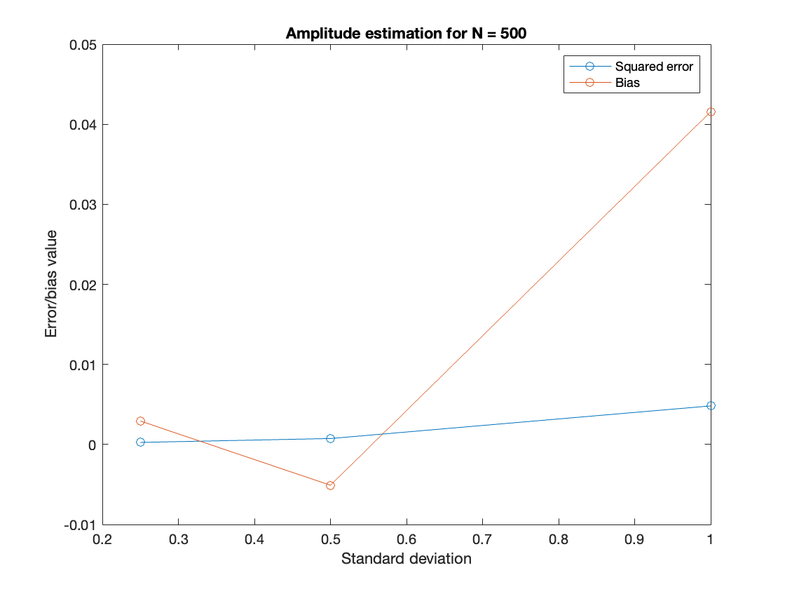
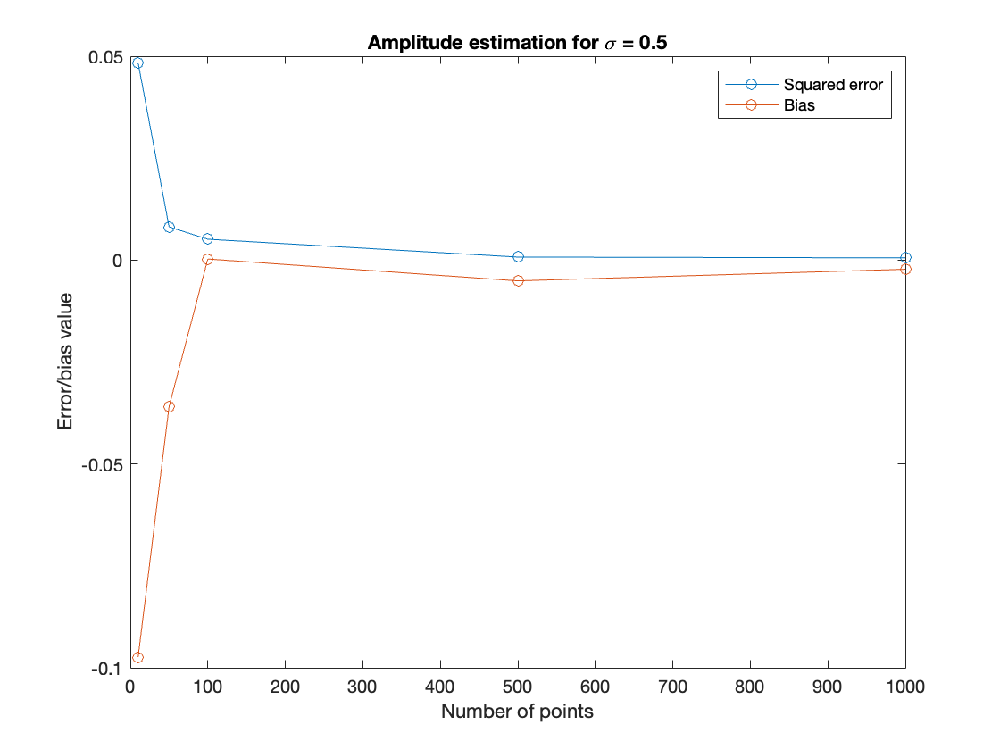
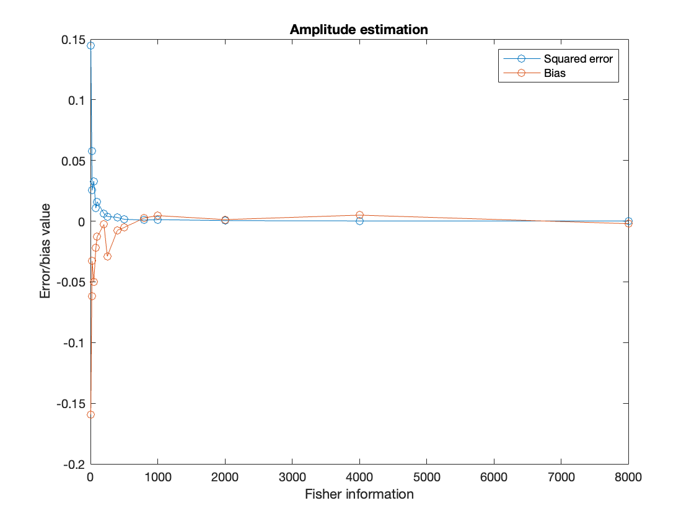

<h1>Estimation problem</h1>

The maximum likelihood estimators for the amplitude and phase of a cosine wave - in the presence of gaussian noise - are derived theoretically and then computed using MATLAB. Several plots are obtained, including those corresponding to the bias and mean squared error as function of the Fisher Information. 

<h2>Results</h2>

